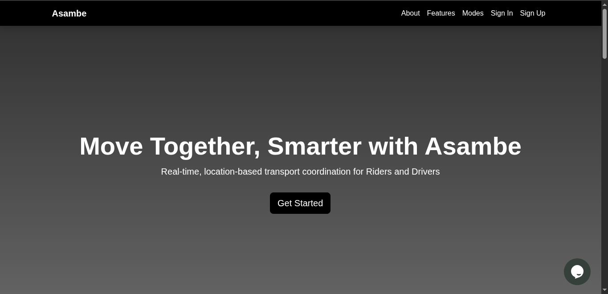
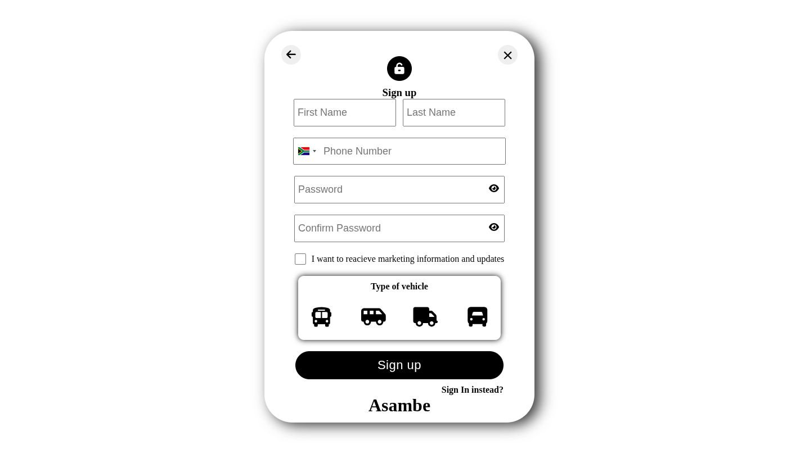

# 🚗 Asambe Platform

[](https://www.python.org/)
[](https://flask.palletsprojects.com/)
[](https://www.mysql.com/)
[](https://www.docker.com/)
[](LICENSE)
[](https://asambe.ncebamandizvidza.tech)

**Asambe** is a ride-hailing web platform connecting rural communities with reliable transportation through real-time mapping and passenger management.

---

## 🔍 Overview

- Get rides across multiple transport modes (van, taxi, quza, bus).  
- Track rides in real-time on a map interface.  
- Receive SMS notifications for ride updates (via Twilio).  
- Separate dashboards for riders and drivers.  
- Containerized for easy deployment with Docker.  

---

## 💡 Insights about Project

Asambe aims to provide a **reliable, scalable, and user-friendly transportation solution** for users in regions with scarce transport options. It emphasizes **real time tracking**, **efficient dispatching**, and **improved communication** between commuters and drivers.

---

## 📚 Project Research
### [Project Research link](https://docs.google.com/document/d/1MW7GNNOZ4nSLKLPp1TL1TSaqwH89TCk-Hl2CDyiKEZU/edit?usp=sharing)
Before development, research was conducted on:  
- Existing ride-hailing platforms and their features  
- Common challenges in ride allocation and tracking  
- Real-time map integration for live tracking  
- Notifications and communication strategies using Twilio  

---

## 🚀 Project MVP
### [Project MVP link](https://docs.google.com/document/d/12ztBlh7bujGghwmrGDVCmwmmi_XplogbblYG4H5jv6c/edit?usp=sharing)
The Minimum Viable Product includes:  
- Rider and driver dashboards  
- Real-time ride booking and tracking  
- Notifications via SMS  
- Multi-transport options  
- Basic web interface with map integration  

---

## 📋 Trello Board

Track project progress and tasks here:  
### [Trello Board Link](https://trello.com/invite/b/gOsYnvYV/ATTI07686ad251a97662b870c7df74565bcbF0DCE265/asambe-web-app)
---

## ✨ Features

- 🗺️ **Interactive Map**: Real-time transport tracking.  
- ⚡ **Instant Notifications**: Updates via Twilio SMS.  
- 🧩 **Role-Based Access**: Separate interfaces for riders and drivers.  
- 🐳 **Dockerized Deployment**: Easy setup across environments.  
- ✅ **RESTful API Backend**: Flask + MySQL for scalability and reliability.  

---

## 🎬 Demo

**Landing Page**  


**Driver Dashboard**  


**Demo Preview**  


---

## 🛠️ Technologies Used

- **Frontend**: HTML, CSS, JavaScript  
- **Mapping**: Leaflet API  
- **Communication**: Twilio API  
- **Backend**: Python, Flask, SQLAlchemy  
- **Database**: MySQL  
- **Real-time**: SocketIO  
- **Web Server**: Nginx  
- **Application Server**: Gunicorn    

---

## 🛠️ Installation

1. Clone the repository:

```bash
git clone https://github.com/yourusername/asambe.git
cd asambe
pip install -r requirement.txt
python app.py
